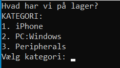

            Lagersystem 1.0 (Official Unofficial) -- Semptember 29, 2022
            H3 python VUS - Jakob J. 29/09-22

            Copyright (C) BOOTYWIZARD ENTERPRISES, Inc.
                        No rights reserved.
# Introduction
This program is in a early stage and has loads of room for improvement.

It was developed for showcase of a simple storage system.

It is possible to list current product information of items that are currently in stock, as well as adding more products to the code. However, in a future deviation of the program, it is planned for the use of either .csv or a database to store product information.

# Prerequisites: 
- Download the program

# Installation:
- git clone https://github.com/jakobjonasjakobsen/lagersystem.git

# System requirements:
Windows
  - Windows 11
  - Windows Server 2022  
  - Windows Server 2019
  - Windows Server 2016
  - Windows 10
  - Windows 8.1
  - Windows Server 2012 R2
  - Windows Server 2012

macOS 
  - macOS 12 (Monterey)
  - macOS 11 (Big Sur)

Linux 
  - Ubuntu 20.04 LTS 64-bit
  - Red Hat Enterprise Linux 8.x 64-bit
  - Red Hat Enterprise Linux 7.x 64-bit

# Usage:

* Run the program and select desired option:

Select 1 to list options for the iPhones category

Select 2 to list options for the Windows PC category

Select 3 to list options for the Peripherals category

Select 1 to list a single selected product

Select 2 to list all products in selected category

---

IF SINGLE PRODUCT WAS SELECTED:

Select a single product to be listed with corresponding number

# Contributing:
Contributions are what make the open source community such an amazing place to learn, inspire, and create. Any contributions you make are greatly appreciated.

If you have a suggestion that would make this better,
please fork the repo and create a pull request. You can also simply open an issue with the tag "enhancement". Thanks again!

Fork the Project
Create your Feature Branch (git checkout -b feature/AmazingFeature)
Commit your Changes (git commit -m 'Add some AmazingFeature')
Push to the Branch (git push origin feature/AmazingFeature)
Open a Pull Request

# Roadmap:
- Make it easier to add new, change or modify products AND/OR implement .csv file usage (if it's free in Community Edition)
- Add MOTD that each day displays a unique single image from a wide array of banging memes
- Extend roadmap

# License:
- This unlicensed project is open source and free to use for everyone and all purposes.

# Acknowledgments
- Freecodecamp.org
- TechCollege
- w3schools

# Contact:
Jakob J. 

jako408j@elev.techcollege.dk

jjj.dk